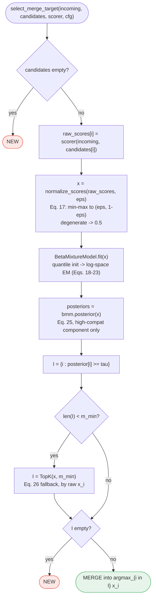

# BMM-gated merge decision (FluxMem Alg. 1, Eqs. 17-26)

`fluxmem/fusion.py::select_merge_target` -- the highest logic-risk module in this
package. Reviewed manually (`/logic-review` skill invocation loop was unresolvable
in-session, see closing report): the review found and fixed a real edge case where a
fully-collapsed BMM component's `mu` could hit exactly `0.0`/`1.0`, producing an invalid
`alpha=0`/`beta=0` Beta parameterization; `_moment_match` now clamps `mu` away from the
boundary in addition to the variance/kappa floors already in place.

## Notes

- The `I` empty branch after the min-keep fallback is reachable only when `m_min = 0` and
  no candidate clears `tau` -- with `m_min >= 1`, the fallback always repopulates `I`
  unless `candidates` was already empty (handled earlier). Tested explicitly
  (`test_m_min_zero_with_unreachable_threshold_is_new`).
- `high_compat_component = argmax_k alpha_k/(alpha_k+beta_k)` is **not** hardcoded to a
  fixed index -- component labels can swap between EM runs; the merge decision only ever
  reads the posterior of whichever index scores highest under this argmax.
