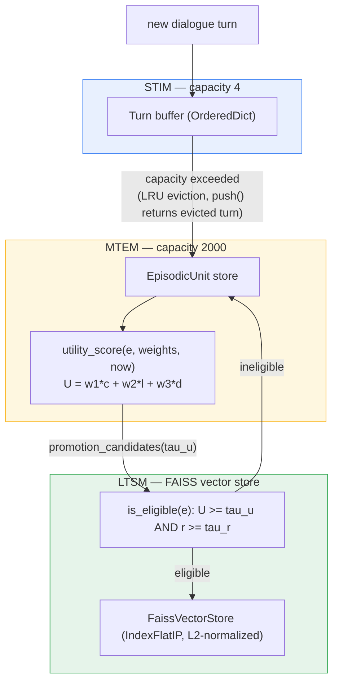

# ADASTORE three-tier memory hierarchy

Implements COLM §1.3.2. STIM buffers raw turns; capacity overflow evicts by
LRU into MTEM. MTEM ranks episodic units by utility `U(e_j)`; episodes that
clear both the utility gate (`U >= tau_u`) and the recency gate (`r >= tau_r`,
LTSM's own hard gate) are promoted into LTSM's vector store. See
`fluxmem/stim.py`, `fluxmem/mtem.py`, `fluxmem/ltsm.py`.

## Notes

- STIM's eviction is LRU (`touch()` matters once a read path re-reads STIM,
  out of scope here), not FIFO -- see `fluxmem/stim.py` docstring.
- The utility gate (`U`, composite of three weighted terms) and the recency
  gate (`r`, a separate hard threshold) are deliberately distinct despite
  both deriving from the same `now - last_access` -- `d(e_j)` inside `U` is a
  soft, tradeable addend; `r(e_j)` in the LTSM gate is a hard, non-negotiable
  conjunct. See `fluxmem/ltsm.py` (Step 8) for the full rationale.
